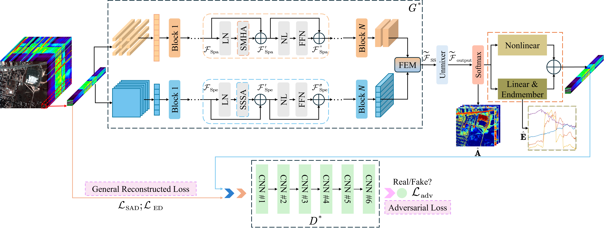

# SSST-GAN: A Sampling-based Spatial-Spectral Transformer Generative Adversarial Network for Hyperspectral Unmixing
**Yu Zhang, Jiageng Huang, Yefei Huang, Youssef Akoudad and Wei Gao**

---

## 1. Abstract

*Below is the abstract from our paper:*

> Hyperspectral unmixing (HU) is a fundamental technique that addresses the mixed-pixel problem in hyperspectral image by decomposing each pixel into a collection of constituent materials (endmembers) and their corresponding proportions (abundances). Recently, Transformer-based architectures have been introduced into the HU domain due to their strong modeling capabilities, achieving promising results. However, existing Transformer-based methods face challenges in effectively capturing and integrating spatial and spectral features. Moreover, most approaches rely heavily on minimizing the reconstruction error between the original and reconstructed images as the primary optimization objective, which limits the overall performance of unmixing. To address these issues, we propose a sampling-based spatial-spectral Transformer generative adversarial Network (SSST-GAN). The proposed model adopts a dual-stream sampling-based Transformer encoder to independently learn spatial and spectral representations. Specifically, the spatial branch employs a full-sampling multi-head attention mechanism to capture rich contextual dependencies among spatial pixels, while the spectral branch utilizes a sparse sampling strategy to efficiently extract key features from high-dimensional spectral data. A feature enhancement module (FEM) is further designed to integrate and reinforce the complementary characteristics of spatial and spectral features. To improve the model's capability in handling complex nonlinear mixing patterns, a generalized nonlinear fluctuation model (GNFM) is incorporated at the decoding stage. In addition, SSST-GAN leverages a generative adversarial learning framework, where a discriminator evaluates the authenticity of reconstructed pixels, thus enhancing the fidelity of unmixing results. Ablation studies validate the contribution of each core component, and extensive experiments on both synthetic and real-world datasets demonstrate that SSST-GAN significantly outperforms several existing state-of-the-art methods in terms of unmixing accuracy.
---

## 2. Overview

The overall framework of **SSST-GAN** is shown below:



The model includes:
- Spectral and spatial encoders
- A feature enhancement module
- A generative adversarial network
- A generalized nonlinear fluctuation model

---

## 3. Citation

If you find this repository helpful in your research, please cite our work:

**Text Format:**

Y. Zhang

**BibTeX Format:**

```bibtex

@ARTICLE{SSST-GAN2025, 
  author={Yu Zhang, Jiageng Huang, Yefei Huang, Youssef Akoudad and Wei Ga},
}
```

---

## 4. Contact Information
If you have any questions, feedback, or collaboration ideas, feel free to reach out:

📧 2212308034@ujs.edu.cn
📧 octopusyyuu@gmail.com
