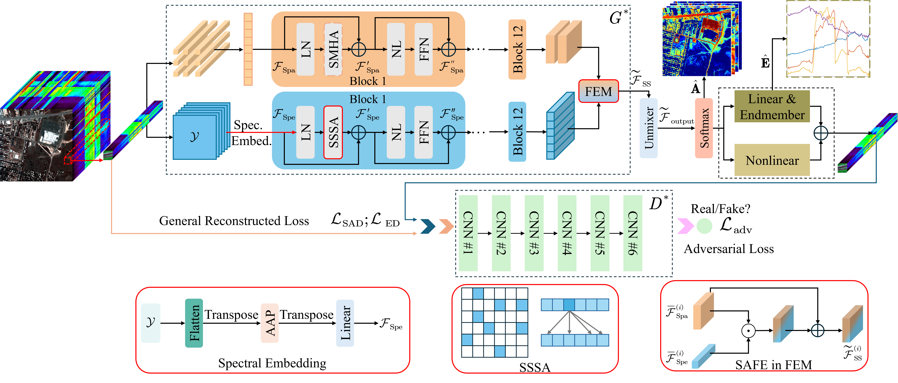

# SSST-GAN: A Sampling-based Spatial-Spectral Transformer Generative Adversarial Network for Hyperspectral Unmixing
**Yu Zhang, Jiageng Huang, Yefei Huang, Youssef Akoudad, Wei Gao and Jie Chen**

---

## 1. Abstract

*Below is the abstract from our paper:*

> Transformer-based architectures have shown strong potential in hyperspectral unmixing due to their powerful modeling capabilities. However, existing these methods struggle to effectively capture and fuse spatial-spectral features. Moreover, their heavy reliance on reconstruction error as the primary optimization objective constrains unmixing performance. To address these challenges, we propose a sampling-based spatial-spectral Transformer generative adversarial network (SSST-GAN). The proposed model employs a dual-stream, sampling-based Transformer encoder to independently extract spatial and spectral representations. Specifically, the spatial branch adopts a full-sampling multi-head attention mechanism to capture rich contextual dependencies among spatial pixels, while the spectral branch utilizes a sparse sampling strategy to efficiently distill key information from high-dimensional spectral data. A feature enhancement module (FEM) is introduced to integrate and strengthen the complementary characteristics of spatial and spectral features. To further improve the model's ability to handle complex nonlinear mixing patterns, a generalized nonlinear fluctuation model (GNFM) is incorporated at the decoding stage. In addition, SSST-GAN leverages a generative adversarial learning framework, where a discriminator assesses the authenticity of reconstructed pixels, thereby enhancing the fidelity of the unmixing results. Extensive experiments on both synthetic and real-world datasets demonstrate that SSST-GAN significantly outperforms several state-of-the-art methods in terms of unmixing accuracy.
---

## 2. Overview

The overall framework of **SSST-GAN** is shown below:



The model includes:
- Spectral and spatial encoders
- A feature enhancement module
- A generative adversarial network
- A generalized nonlinear fluctuation model

---

## 3. Citation

If you find this repository helpful in your research, please cite our work:

**Text Format:**

Y. Zhang

**BibTeX Format:**

```bibtex

@ARTICLE{SSST-GAN2025, 
  author={Yu Zhang, Jiageng Huang, Yefei Huang, Youssef Akoudad, Wei Gao and Jie Chen},
}
```

---

## 4. Contact Information
If you have any questions, feedback, or collaboration ideas, feel free to reach out:

📧 2212308034@ujs.edu.cn
📧 octopusyyuu@gmail.com
